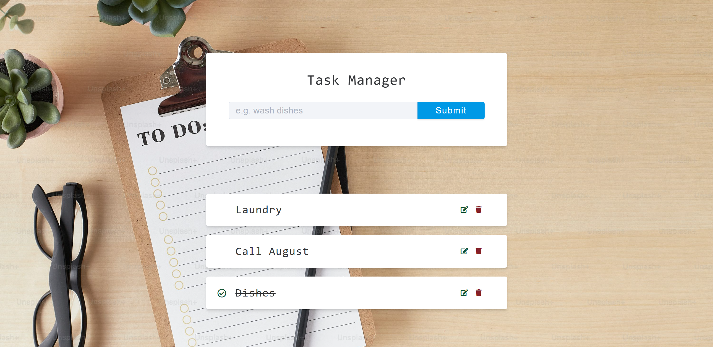
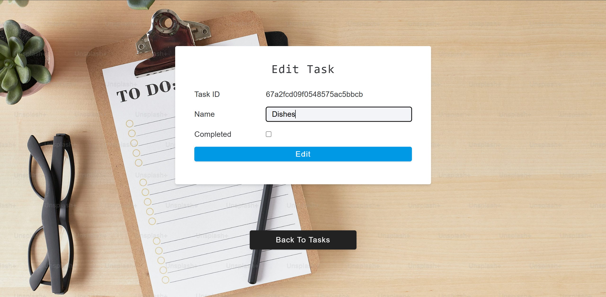

# 📝 Task Manager App

A simple and clean **Task Manager** (To-Do List) built using the **MERN stack** (MongoDB, Express.js, Node.js) and deployed on **Render**. Users can add, view, update, and delete tasks — all through a RESTful API connected to a dynamic frontend.

---

## 🚀 Live Demo

🔗 [View Live App](https://task-manager-phcn.onrender.com)

---

## 📸 Screenshots




---

## ⚙️ Features

- ✅ Create, Read, Update, and Delete tasks
- ✅ RESTful API using Express.js
- ✅ MongoDB + Mongoose for database and schema modeling
- ✅ Mongoose validations for clean data
- ✅ Fully connected frontend with Axios and dynamic DOM updates
- ✅ Error handling middleware and async utility wrapper
- ✅ Deployed on Render with `.env` support

---

## 🧠 Technologies Used

### Backend
- **Node.js**
- **Express.js**
- **MongoDB** with **Mongoose**
- **dotenv**, **axios**

### Frontend
- HTML5, CSS3 (from template), JavaScript
- Axios for HTTP requests

---

## 📌 REST API Endpoints

| Method | Endpoint            | Description             |
|--------|---------------------|-------------------------|
| GET    | `/api/v1/tasks`     | Get all tasks           |
| POST   | `/api/v1/tasks`     | Create new task         |
| GET    | `/api/v1/tasks/:id` | Get single task by ID   |
| PATCH  | `/api/v1/tasks/:id` | Update task by ID       |
| DELETE | `/api/v1/tasks/:id` | Delete task by ID       |

---

## 🛠️ Setup Instructions

1. **Clone the repo**  
   ```bash
   git clone https://github.com/aashita-radhika/Task-Manager.git
---

### 🛠️ Setup Instructions

#### ✅ Install dependencies

```bash
npm install
```

#### ✅ Add your MongoDB URI in `.env`

```ini
MONGO_URI=your_mongodb_connection_string
```

#### ✅ Run the app

```bash
npm start
```

#### ✅ Open in browser

Go to: [http://localhost:3000](http://localhost:3000)

---

### 🌐 Deployment

* Hosted on **[https://task-manager-phcn.onrender.com/](https://task-manager-phcn.onrender.com/)**
* `.env` is used to store the MongoDB connection string securely
* Deployed as a **Web Service**
* Auto-redeploy on every Git push

---

### 💡 What I Learned

* Structuring a backend with **MVC pattern**
* Using **Mongoose** for schema validation
* Writing **custom middleware** and error handlers
* Connecting frontend to backend using **Axios**
* Deploying full-stack apps to the **cloud**

---

### 📞 Contact

* 💬 [linkedin.com/in/aashita-radhika/](https://www.linkedin.com/in/aashita-radhika/)
* 📧 [aashita.2515@gmail.com](mailto:aashita.2515@gmail.com)

---

> Built with Node.js, and a lot of coffee ☕️ by **Aashita** 


